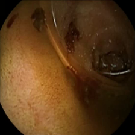
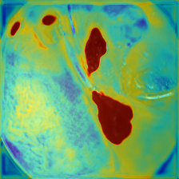

# AutoWCEBleed-Challenge-DeepNet
This a submission to the contest conducted by MISAHUB titled AutoWCEBleed-Challenge

# Auto-WCEBleedGen Challenge
Automatic Classification, Segmentation and Detection of Bleeding and Non-Bleeding Frames in a Wireless Capsule Endoscopy Images.

## Achieved Evaluation Metrics 

### Classification Metrics

|               |          |
|---------------|----------|
| Accuracy      | 0.9647   |
| Precision     | 0.9513   |
| Recall        | 0.9841   |
| F1 Score      | 0.9674   |

### Segmentation Metrics
|                           |   Mean | Std    |
|---------------------------|--------|--------|
| Mean IoU                  | 0.6849 | 0.3495 |
| Average Precision         | 0.3723 | 0.4096 |
| Mean Average Precision    | 0.3731 |    -   |

## Some Predicted Image of Validation Dataset

    Image                     Ground Truth                  Prediction                  CAM plot    
    

## Acknowledgement
The codes are modified from [DCSAU-Net](https://github.com/xq141839/DCSAU-Net)
